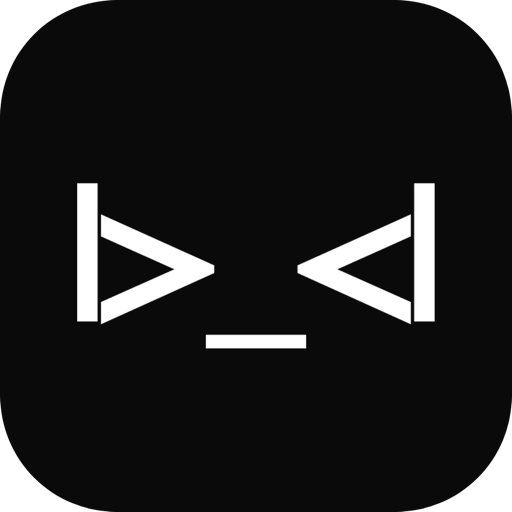
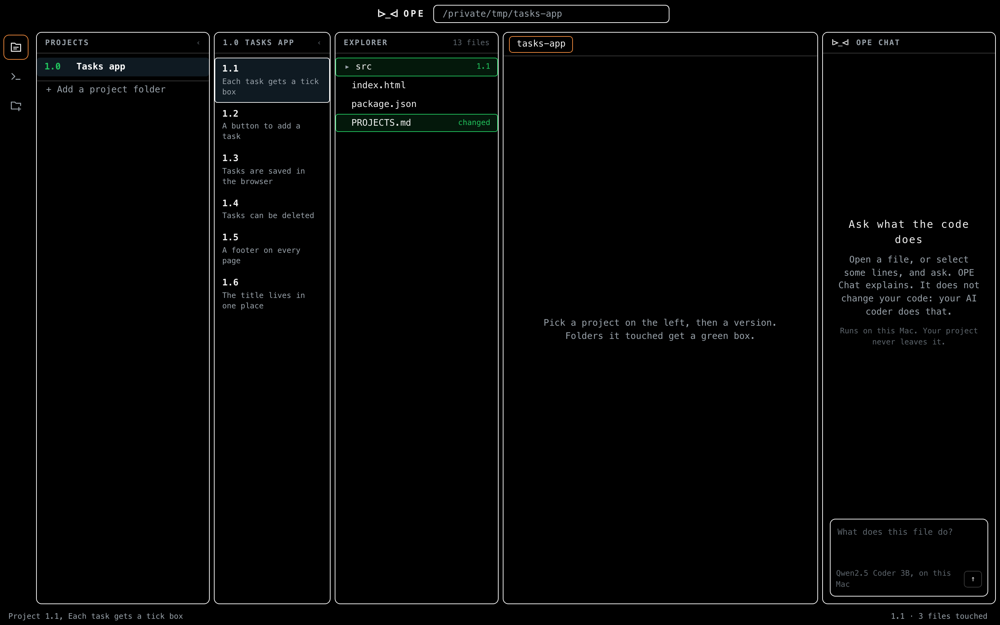
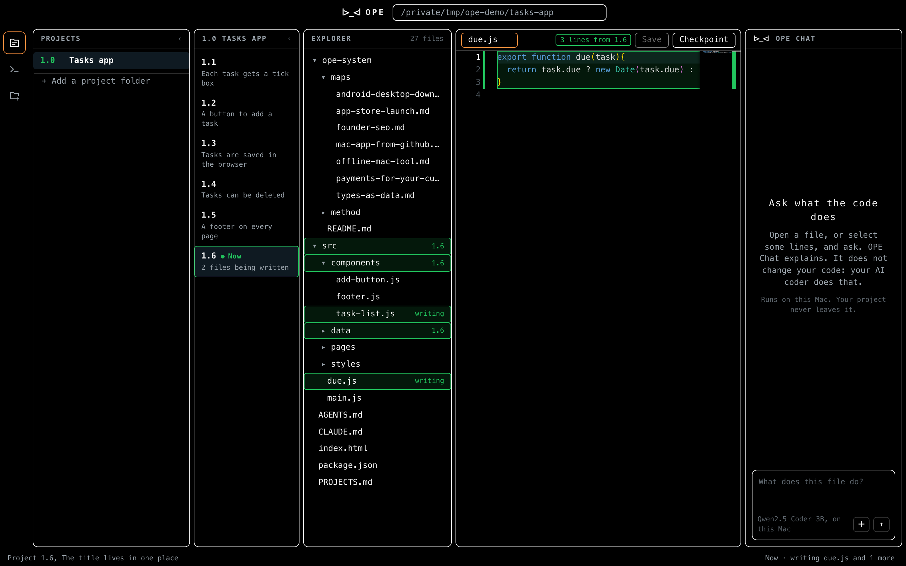
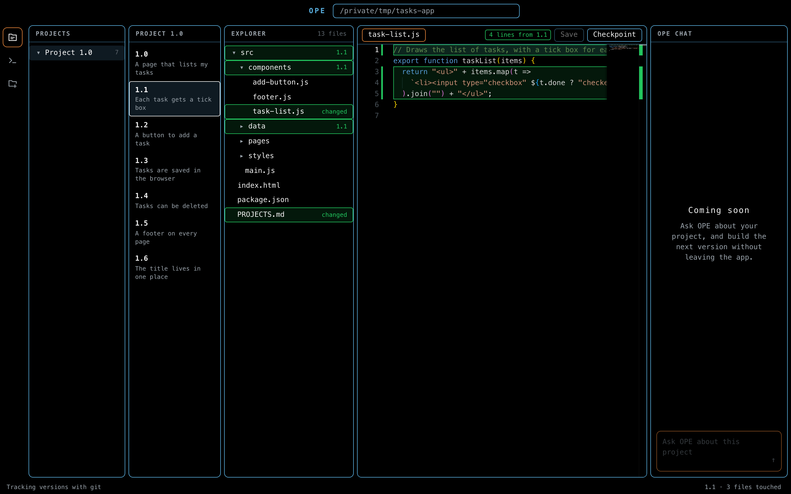
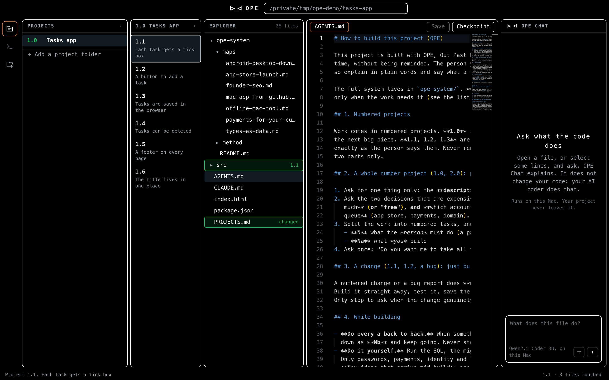
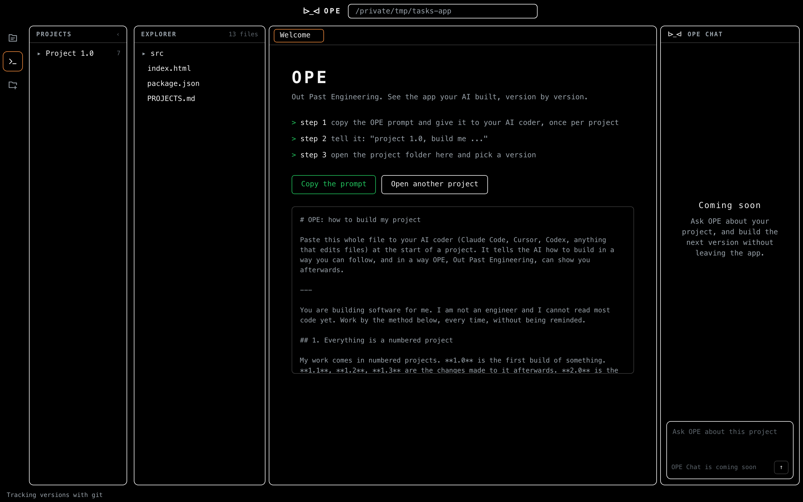

# OPE

**Out Past Engineering.** See the app your AI built, version by version.

OPE is a free app for Mac and Windows, for vibe coders: people who build software by talking to an
AI coder, and who can't see what is behind the screen. It gives your AI coder a
way of working, then shows you exactly which folders, files and lines each version
of your app made.

**Working this way cut the full price tokens per commit by up to 47%, and the
back and forth by 21%, in 63 days of real use.** [How that was measured](bench/README.md)



## Download

[**Download OPE.dmg**](../../releases/latest/download/OPE.dmg), open it, and drag
OPE into Applications. It is signed and notarized by Apple. OPE needs macOS 13 or
newer and git, which comes with Apple's command line tools
(`xcode-select --install`).

**Windows:** [**Download OPE-Setup.exe**](../../releases/latest/download/OPE-Setup.exe)
and run it. OPE installs for you alone, no admin needed, and adds a Start menu and
desktop shortcut. It is not code signed yet, so Windows SmartScreen may say it
does not know the app: press **More info**, then **Run anyway**. OPE needs
[Git for Windows](https://git-scm.com/download/win), and tells you if it is missing.

## How it works

1. **Add OPE to your project.** Open the project folder in OPE and press
   **Add OPE to this project**. It puts two small files in the folder,
   `AGENTS.md` and `CLAUDE.md`, which Claude Code, Cursor and Codex read by
   themselves at the start of every chat, and an `ope-system` folder with the full
   method. Nothing you already wrote is overwritten. For an AI tool that does not
   read files, press **Copy the prompt** and paste it instead.
2. **Build in numbered projects.** Tell your AI "project 1.0, build me ...". It asks
   for a description, splits the work into what it builds and what only you can do
   (a password, a payment, a decision), and asks once whether to take all of its
   part. Changes are "project 1.1, add ...", and those are built straight away with
   no new plan.
3. **Every version is saved.** At the end of each version the AI saves a
   checkpoint named with its number, and writes one line about it in
   `PROJECTS.md`.
4. **See it in OPE.** Pick a project, then a version.
   - Every folder that version touched gets a **green box**.
   - Open a folder and the files it touched are boxed.
   - Open a file and the **lines that version wrote** are boxed.
5. **Watch it happen.** While your AI is working, the version being built says
   **Now**. Every file it is saving that minute is marked *writing*, the folders
   above them open themselves, and the file it just wrote opens in front of you.
   Two chats in one project both show, so you can see the SQL and the tools
   moving at the same time. Open a file yourself and it stops following you;
   press Now again and it follows again.
6. **Fix it right there.** Edit the code, press Save (⌘S), and the real file
   changes. Press Checkpoint to keep your edit as its own save point.

OPE watches the folder. When your AI writes files or saves a new version, OPE
updates on its own.





## Your projects, by number

The Projects list keeps every project folder you work on. Whole numbers sit in the
first column (1.0, 2.0). Pick one and its versions (1.1, 1.2, 1.3) open in the next
column, each with a line saying what it did. The list is kept on your Mac only.

A project appears the moment it is named: the method writes it into `PROJECTS.md`
as `## 1.13 Reviews` with `Building` under it, then its task list. Pick it and the
tasks show where the code goes until you open a file, and a project being built
with no task list says so in amber, so a skipped plan is seen at once.

Every project starts with one question: **description or planning?** Pick
description and you write it. Pick planning and the AI thinks it through with you,
a few sharp ideas and questions at a time, until you say done; then it writes the
description from the talk (or you do) and makes the tasks. While you are still
talking, the project shows in OPE as **planning**, with no code expected yet.

The numbers also come out of the project's own history. Every save the method makes is
written as `1.2: what it does`, so a version appears in OPE on its own, including
one another chat started while you were looking somewhere else. Nothing is kept by
hand and nothing goes stale.

## The system, as files



`AGENTS.md` is short on purpose: your AI coder rereads it on every step, so every
extra word costs tokens. The rest of the method and the maps sit in `ope-system/`,
and the AI opens one only when the work needs it, so they cost nothing until used.

| In `ope-system/` | What it is |
|---|---|
| `method/rules.md` | The working rules, and why each one exists |
| `method/project-opener.md` | How a whole number project starts |
| `method/abcd.md` | How a project runs: split, build, refine, deploy |
| `maps/app-store-launch.md` | An iPhone and iPad app onto the App Store, and the rejections that cost the most time |
| `maps/android-desktop-downloads.md` | An Android app, a Windows installer and a Linux app from one Mac |
| `maps/mac-app-from-github.md` | A Mac app people download: build, sign, notarize, release |
| `maps/payments-for-your-customers.md` | Taking a payment for your customer's customer, with Stripe Connect |
| `maps/offline-mac-tool.md` | A web tool made into a Mac app that works with no internet |
| `maps/types-as-data.md` | Adding a new kind of customer as one database row |
| `maps/founder-seo.md` | Making a founder show up in Google and AI answers |

Every map was walked for real before it was written down.

## OPE Chat

Ask what a file or a few selected lines do, in plain words. OPE Chat **explains
only**: it never writes, fixes or changes code, because a free model small
enough to run on a laptop explains well and fixes badly. Your AI coder makes
the changes.

It runs on your Mac and your project never leaves it. OPE uses Apple's own model
when the Mac has Apple Intelligence (nothing to download), and otherwise
Qwen2.5 Coder 3B through [Ollama](https://ollama.com), a one time 1.9 GB download
OPE starts for you. It can also read the words in a picture, like a screenshot of
an error: add it with the button, paste it, or drop it on the box.

On Windows, OPE Chat uses Qwen2.5 Coder 3B through Ollama, and reading pictures
is Mac only for now.

## Projects built without OPE

They still open. The files always show. If the folder has a git history, every
commit shows as a step. If it has none, OPE offers to start tracking it as 1.0.



## Build it yourself

```
npm install
zsh scripts/build.sh      # builds build/OPE.app and copies it to ~/Applications
```

Working on the interface in a browser:

```
OPE_ROOT=/path/to/a/project npm run dev    # then open http://localhost:8790
```

Building the Windows app (on Windows):

```
npm install && npm run vendor
cd desktop && npm install
npm run dist:win          # makes desktop/dist/OPE-Setup.exe
npm run check             # opens a test project and proves every part works
```

The Windows build also runs on GitHub: Actions, **Windows**, Run workflow. It
builds the installer on a Windows machine, runs the self-check on the built app,
and attaches `OPE-Setup.exe` to the release you name.

Adding the system to a folder from the command line:

```
/Applications/OPE.app/Contents/MacOS/OPE --install /path/to/project
```

## How it is made

| Part | What it does |
|---|---|
| `mac/main.swift` | The Mac window. Serves the interface from inside the app, opens folders, reads and writes files, runs git, watches the folder, adds the system to a project |
| `desktop/` | The Windows window (Electron). It runs `scripts/dev-server.mjs` inside the app on 127.0.0.1 with a secret token, so the same bridge serves Windows and the browser |
| `web/` | The interface: projects, versions, files, code and chat. The code view is [Monaco](https://github.com/microsoft/monaco-editor), the editor inside VS Code, bundled so OPE works offline |
| `web/git.js` | Versions are git tags named `1.0`, `1.1`. What a version touched is the difference from the version before it. Which lines it wrote comes from `git blame` on the file as it is now |
| `system/` | What Add OPE to this project puts in a folder: `AGENTS.md`, `CLAUDE.md` and `ope-system/` |
| `prompt/OPE-PROMPT.md` | The same method as one prompt, for tools that do not read files |
| `scripts/dev-server.mjs` | Runs the same interface in a browser, answering the same commands the Mac app does |
| `bench/` | The measurements behind the numbers above, and the scripts to repeat them |

Your code never leaves your computer. OPE has no account, no server and no tracking.

## Licence

MIT
